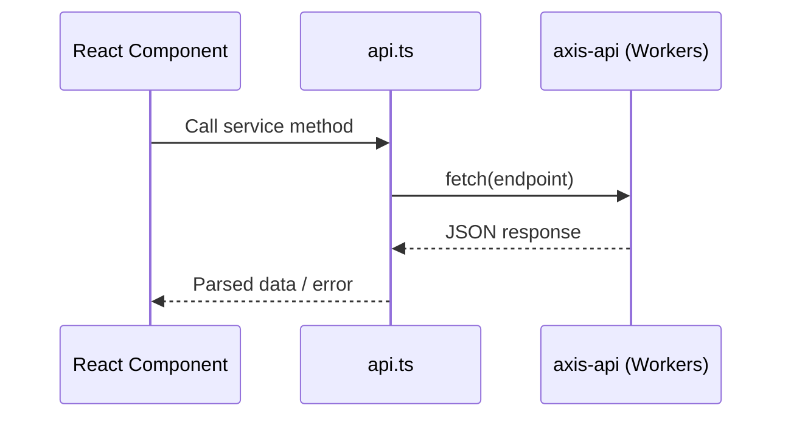
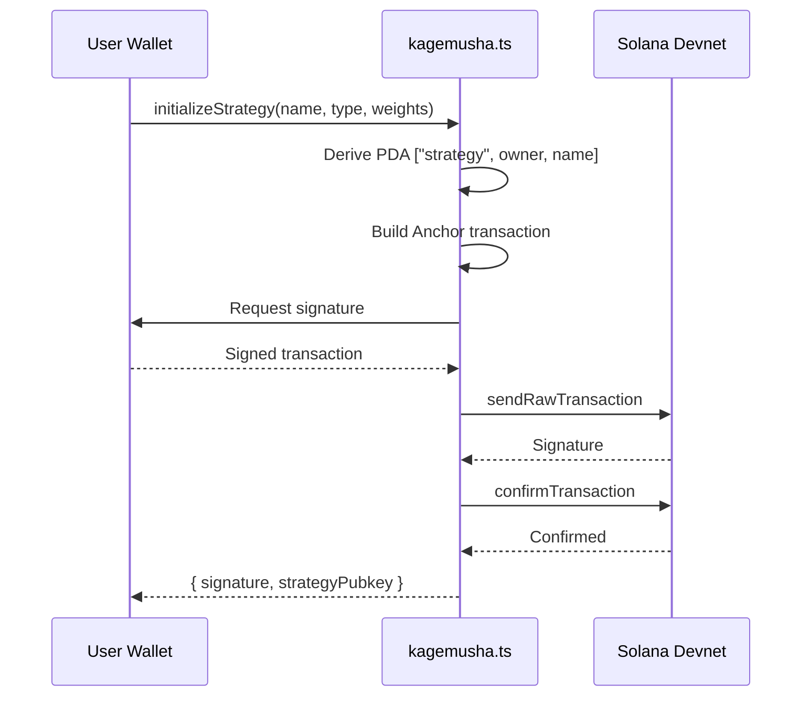
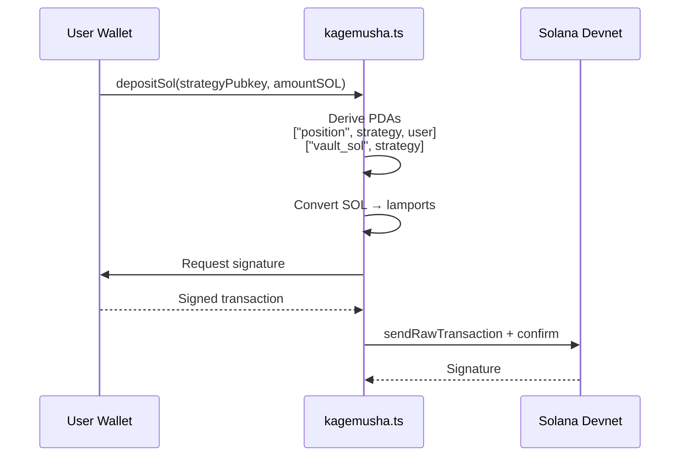

# API & Interface Specification

## Backend REST API (api.ts → axis-api)

Base URL: `https://axis-api.yusukekikuta-05.workers.dev` (overridable via env `VITE_API_URL`)

### Request Flow



### User Management

| Method | Endpoint | Description | Request Body | Response |
|--------|----------|-------------|-------------|----------|
| GET | `/user?wallet={pubkey}&ref={ref}` | Get user (empty if not registered) | query: wallet, ref (optional) | `{ name, username, pfpUrl, avatar_url, total_xp, rank_tier, ... }` |
| POST | `/user` | Update profile | `{ wallet_address, name, bio, avatar_url }` | TBD |
| POST | `/register` | Register new user | `{ email, wallet_address, invite_code_used, avatar_url?, name?, bio? }` | TBD |
| POST | `/request-invite` | Request invitation | `{ email }` | TBD |
| POST | `/users/{pubkey}/checkin` | Daily check-in | None | TBD |
| POST | `/user/stats` | Sync user stats | `{ wallet_address, pnl_percent, total_invested_usd }` | None (fire-and-forget) |

### Strategy

| Method | Endpoint | Description | Request Body | Response |
|--------|----------|-------------|-------------|----------|
| POST | `/strategies` | Create strategy | `{ owner_pubkey, name, ticker, description?, type, tokens: [{symbol, mint, weight, logoURI?}], address, config? }` | TBD |
| GET | `/strategies/{pubkey}` | List user's strategies | — | TBD |
| GET | `/strategies/{id}/chart?period={7d}&type={line\|candle}` | Strategy chart data | query: period, type | TBD |
| POST | `/strategies/{id}/watchlist` | Toggle watchlist | `{ userPubkey }` | TBD |
| GET | `/strategies/{id}/watchlist?user={pubkey}` | Check watchlist status | query: user | TBD |
| GET | `/discover?limit={50}&offset={0}` | Discover strategies | query: limit, offset | TBD |

### Token

| Method | Endpoint | Description |
|--------|----------|-------------|
| GET | `/tokens` | Token list |
| GET | `/tokens/search?q={query}&limit={20}` | Token search |
| GET | `/tokens/{address}/history?interval={1h\|1d\|1w}` | Token price history |
| GET | `/price/sol` | Get SOL price → `{ price: number }` |

### Deployment

| Method | Endpoint | Description | Request Body |
|--------|----------|-------------|-------------|
| GET | `/prepare-deployment` | Prepare deployment | — |
| POST | `/deploy` | Execute deployment | `{ signature, ...strategyData }` |

### Other

| Method | Endpoint | Description | Request Body |
|--------|----------|-------------|-------------|
| GET | `/leaderboard?sort={points\|volume\|created}` | Leaderboard | query: sort |
| GET | `/vaults` | Vault list | — |
| POST | `/upload/image` | Image upload | FormData: `{ image: File, wallet_address, type: 'profile'\|'strategy' }` |
| GET | `/upload/image/{key}` | Image retrieval (proxy) | — |
| POST | `/analyze` | AI strategy analysis | `{ directive, tags: string[], customInput? }` |
| POST | `/art/generate` | Strategy art generation | `{ tokens: string[], strategyType, walletAddress }` |
| POST | `/claim` | Faucet (get Devnet SOL) | `{ wallet_address }` |

> **Note**: Many response formats are marked "TBD" — verify exact types against the backend source.

---

## On-Chain Interface (kagemusha.ts → Solana Program)

Program ID: `2kdDnjHHLmHex8v5pk8XgB7ddFeiuBW4Yp5Ykx8JmBLd`

### Strategy Creation Flow



### Deposit Flow



### Instructions

#### `initializeStrategy`

```
Accounts:
  strategy      (mut, PDA: ["strategy", owner, name])
  owner         (mut, signer)
  systemProgram

Args:
  name: string
  strategyType: u8           // 0=AGGRESSIVE, 1=TBD, 2=BALANCED
  targetWeights: Vec<u16>    // Fixed 10 elements, per-token weight (sum = 10000 = 100%)
```

#### `depositSol`

```
Accounts:
  strategy      (mut)
  position      (mut, PDA: ["position", strategy, user])
  user          (mut, signer)
  vaultSol      (mut, PDA: ["vault_sol", strategy])
  systemProgram

Args:
  amount: u64    // lamports
```

#### `withdrawSol` (experimental — may not be implemented on-chain)

```
Accounts: Same as depositSol
Args:
  amount: u64    // lamports
```

### Account Structure

#### Strategy

```rust
pub struct Strategy {
    owner: Pubkey,
    name: String,
    strategy_type: u8,
    target_weights: Vec<u16>,   // Fixed 10 elements
    num_tokens: u8,
    is_active: bool,
    tvl: u64,                   // lamports
    fees_collected: u64,
    last_rebalance: i64,        // Unix timestamp
}
```

---

## Third-Party APIs

### Jupiter Lite API v2

| Endpoint | Purpose |
|----------|---------|
| `GET lite-api.jup.ag/tokens/v2/tag?query=verified` | Verified token list |
| `GET lite-api.jup.ag/tokens/v2/search?query={q}` | Token search |
| `GET lite-api.jup.ag/price/v3?ids={mint1,mint2}` | Batch price fetch |

Auth: `x-api-key` header (env: `VITE_JUPITER_API_KEY`)

### CoinGecko API v3

| Endpoint | Purpose |
|----------|---------|
| `GET api.coingecko.com/api/v3/coins/markets?category=solana-ecosystem&...` | Solana tokens by market cap |
| `GET api.coingecko.com/api/v3/simple/token_price/solana?contract_addresses={mints}` | Price by mint address |

Auth: None (rate-limited; TBD: whether a Pro key exists)

### DexScreener API

| Endpoint | Purpose |
|----------|---------|
| `GET api.dexscreener.com/latest/dex/tokens/{mint1,mint2,...}` | Price & 24h change (chunked by 30) |

Auth: None (300 req/min)

### GeckoTerminal API v2

| Endpoint | Purpose |
|----------|---------|
| `GET api.geckoterminal.com/api/v2/networks/solana/tokens/{address}/pools?page=1&limit=1` | Get top pool for a token |
| `GET api.geckoterminal.com/api/v2/networks/solana/pools/{pool}/ohlcv/{timeframe}?limit=100` | OHLCV data (day/hour/minute) |

Auth: None

---

## Core Data Structures (src/types/index.ts)

### TokenInfo

```typescript
interface TokenInfo {
  symbol: string;
  name: string;
  address: string;       // Solana mint address
  logoURI?: string;
  sector?: string;
  price?: number;
  priceFormatted?: string;
  change24h?: number;
}
```

### TokenAllocation

```typescript
interface TokenAllocation {
  symbol: string;
  address?: string;
  mint?: string;
  weight: number;         // 0–1 ratio
  logoURI?: string;
  token?: TokenInfo;
}
```

### Strategy

```typescript
interface Strategy {
  id: string;
  name: string;
  ticker?: string;
  type: 'AGGRESSIVE' | 'BALANCED' | 'CONSERVATIVE';
  description?: string;
  tokens: TokenAllocation[];
  metrics?: {
    expectedApy: number;
    riskScore: number;
    winRate: number;
    sharpeRatio: number;
  };
  apy?: number;
  tvl?: number | string;
  price?: number;
  owner?: string;
  backtest?: {
    timestamps: number[];
    values: number[];
    sharpeRatio: number;
    maxDrawdown: number;
    volatility: number;
  };
  createdAt?: number;
  aiSuggestion?: string;
}
```

### Vault

```typescript
interface Vault {
  id: string;
  name: string;
  symbol: string;
  creator: string;
  tvl: number;
  apy: number;
  performance7d: number;
  performance30d: number;
  composition: TokenAllocation[];
  imageUrl?: string;
  holders?: number;
  rank?: number;
}
```

### Zustand Store (useTacticalStore)

```typescript
interface TacticalStore {
  step: 'DIRECTIVE' | 'MATRIX' | 'SIMULATION' | 'ASSEMBLY' | 'DEPLOYMENT';
  directive: string;
  selectedTags: string[];
  generatedTactics: Tactic[];
  selectedTactic: Tactic | null;
  pizzaComposition: Token[];    // Final token composition

  // Actions
  setStep, setDirective, toggleTag, setTactics, selectTactic, updatePizza, addToken
}
```

### Tactic (defined in Zustand store)

```typescript
interface Tactic {
  id: string;
  name: string;
  type: 'SNIPER' | 'FORTRESS' | 'WAVE';
  description: string;
  tokens: Token[];
  metrics: {
    winRate: string;
    expectedRoi: string;
    riskLevel: string;
    backtest: number[];
  };
}
```

### CreateStep

```typescript
type CreateStep = 'SELECT' | 'CUSTOMIZE' | 'REVIEW' | 'DEPLOY';
```

> **Note**: `Strategy.type` uses `AGGRESSIVE | BALANCED | CONSERVATIVE`, while `Tactic.type` uses `SNIPER | FORTRESS | WAVE`. TBD: whether this is intentional or should be unified.
