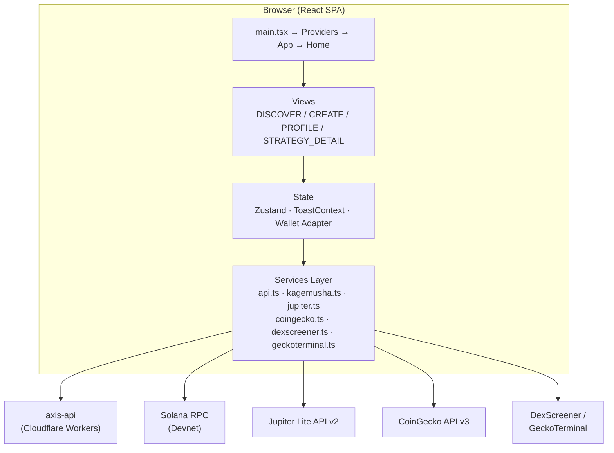
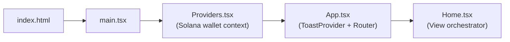

# Architecture

## Overview

axis-agent is a frontend-only SPA (Single Page Application).
The backend API (`axis-api`) is managed in a separate repository.

### System Architecture

### Application Bootstrap

## Entry Points

| File | Role |
|------|------|
| `index.html` | HTML shell. Loads `/src/main.tsx` as a module |
| `src/main.tsx` | ReactDOM.createRoot. Mounts `<Providers>` → `<App>` |
| `src/Providers.tsx` | Provides Solana ConnectionProvider / WalletProvider / WalletModalProvider. Network is **Devnet** |
| `src/App.tsx` | ToastProvider + RouterProvider. Stores referral code (`?ref=`) to localStorage |
| `src/router.tsx` | Uses react-router-dom. Currently only one route: `/` → `Home` |
| `src/Home.tsx` | Main orchestrator. Switches between 4 views via internal state (`view`) |

## Major Modules & Responsibilities

### Views (src/components/)

| Directory | Responsibility |
|-----------|---------------|
| `components/discover/` | Strategy listing and swipe browsing (`DiscoverView`, `StrategyDetailView`, etc.) |
| `components/create/` | Strategy creation wizard. 23 components. `KagemushaFlow` controls the entire flow |
| `components/profile/` | User profile display and editing |
| `components/common/` | Shared UI (Toast, PriceChart, FloatingNav, ProfileDrawer, etc.) |

### State Management

| Module | Type | Responsibility |
|--------|------|---------------|
| `store/useTacticalStore.ts` | Zustand | All state for the strategy creation flow (step, directive, tokens, generated tactics) |
| `context/ToastContext.tsx` | React Context | App-wide toast notifications (success/error/info, 3-second auto-dismiss) |
| Wallet Adapter Context | React Context (external lib) | Wallet connection state, publicKey, signTransaction |

### Services Layer (src/services/)

| File | Target | Responsibility |
|------|--------|---------------|
| `api.ts` | axis-api (Cloudflare Workers) | User management, strategy CRUD, token search, deploy, leaderboard, image upload, AI analysis |
| `kagemusha.ts` | Solana RPC (Devnet) | On-chain program (Anchor). Strategy initialization (PDA), SOL deposit/withdraw, account queries |
| `jupiter.ts` | lite-api.jup.ag | Token list retrieval, token search, price fetching. Memory + localStorage cache (6h TTL) |
| `coingecko.ts` | api.coingecko.com | Solana ecosystem tokens ranked by market cap, mint-address-based price fetching. 5-min cache |
| `dexscreener.ts` | api.dexscreener.com | Price and 24h change for memecoins / Pump.fun tokens. 30-sec cache |
| `geckoterminal.ts` | api.geckoterminal.com | OHLCV chart data (pool-based). Formatted for Lightweight Charts |

### Hooks (src/hooks/)

| Hook | Responsibility |
|------|---------------|
| `useWallet()` | Wrapper around Solana wallet connection state + ready/authenticated flags |
| `useConnection()` | Retrieves the Solana Connection object |
| `useToast()` | Shortcut for ToastContext |

## Dependencies

### External Services

| Service | Purpose | Auth |
|---------|---------|------|
| axis-api (`axis-api.yusukekikuta-05.workers.dev`) | Backend REST API | None (TBD: auth mechanism) |
| Solana Devnet RPC | Blockchain operations | None (public RPC) |
| Jupiter Lite API v2 (`lite-api.jup.ag`) | Token data & prices | API Key (header `x-api-key`, env: `VITE_JUPITER_API_KEY`) |
| CoinGecko API v3 | Market data | None (rate-limited; TBD: whether a Pro key exists) |
| DexScreener API | Price & change | None (300 req/min) |
| GeckoTerminal API v2 | OHLCV charts | None |

### On-Chain Program

| Item | Value |
|------|-------|
| Program ID | `2kdDnjHHLmHex8v5pk8XgB7ddFeiuBW4Yp5Ykx8JmBLd` |
| Framework | Anchor 0.29 |
| Network | Solana Devnet |
| Instructions | `initializeStrategy`, `depositSol`, `withdrawSol` (withdrawSol is experimental) |
| PDA Seeds | `["strategy", owner, name]` / `["position", strategy, user]` / `["vault_sol", strategy]` |
| Account Structure (Strategy) | owner, name, strategyType (u8), targetWeights (vec u16, fixed 10 elements), numTokens, isActive, tvl, feesCollected, lastRebalance |

### Key npm Dependencies

| Category | Packages |
|----------|----------|
| Framework | React 19, react-router-dom 7, Vite 6 |
| Solana | @solana/web3.js 1.98, @coral-xyz/anchor 0.29, @solana/spl-token 0.3, wallet-adapter |
| UI | Tailwind CSS 4, Framer Motion 11, Radix UI, Headless UI, Lucide React |
| Charts | Recharts 3, Lightweight Charts 4 |
| State | Zustand 5 |
| Other | clsx, tailwind-merge, html2canvas, buffer (polyfill) |

## Deployment

- Hosting: **Cloudflare Pages**
- Config: `wrangler.jsonc` (project name: `axis-mvp`)
- Output: `dist/`
- Compatibility flag: `nodejs_compat`

## TBD / Open Questions

- Location of the backend (axis-api) source code / repository
- axis-api authentication mechanism (currently called without auth headers from the frontend)
- Location of the Kagemusha on-chain program source code
- On-chain implementation status of `withdrawSol` (frontend comments indicate it may not be implemented yet)
- Plans for Privy Auth integration (currently commented out in App.tsx)
- Mainnet migration plan (currently hardcoded to Devnet)
- Whether a CoinGecko Pro API key exists
