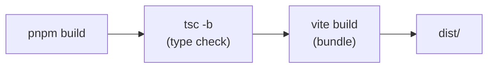
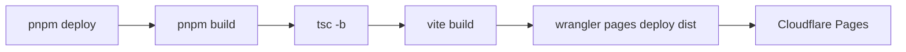

# Development Guide

## Prerequisites

- Node.js (TBD: minimum version; Vite 6 requires Node 18+)
- pnpm (package manager)
- Solana-compatible wallet extension (Phantom, etc.)

## Setup

```bash
# Install dependencies
pnpm install

# Environment variables (.env file required at project root)
# VITE_JUPITER_API_KEY=...
# VITE_PRIVY_APP_ID=...          # Currently unused (commented out)
# VITE_API_URL=...               # Optional. Defaults to production axis-api if unset
```

## Dev Server

```bash
pnpm dev
```

Starts the Vite dev server with HMR (Hot Module Replacement).
Connecting a wallet extension in the browser will connect to Solana Devnet.

## Build

```bash
pnpm build
```

Runs `tsc -b` (TypeScript type checking) followed by `vite build`. Output goes to `dist/`.

### Build Pipeline



## Lint

```bash
pnpm lint
```

Runs ESLint (flat config) across all `.ts` / `.tsx` files.
Rules: TypeScript ESLint recommended + React Hooks + React Refresh.

## Tests

No test framework is configured. There are currently no tests.

## Deploy

```bash
pnpm deploy
```

Runs `pnpm build` → `wrangler pages deploy dist` sequentially. Deploys to Cloudflare Pages.
Requires Wrangler authentication (`wrangler login` or `CLOUDFLARE_API_TOKEN` env variable).

### Deploy Pipeline



## Debugging

### Browser DevTools

All services output logs via `console.log` / `console.warn` / `console.error` with prefixes:

| Service       | Log Prefix                                                       |
| ------------- | ---------------------------------------------------------------- |
| Jupiter       | `[Jupiter]`                                                      |
| CoinGecko     | `[CoinGecko]`                                                    |
| DexScreener   | `[DexScreener]`                                                  |
| GeckoTerminal | `[GeckoTerminal]`                                                |
| api.ts        | Varies: `"Fetch User Error:"`, `"Create Strategy Failed:"`, etc. |

### Cache Troubleshooting

If token data appears stale or incorrect:

| Service          | Cache Type                                   | TTL        | How to Clear                                                              |
| ---------------- | -------------------------------------------- | ---------- | ------------------------------------------------------------------------- |
| Jupiter (tokens) | Memory + localStorage (`jup_tokens_v3_lite`) | 6 hours    | Delete localStorage key, or call `JupiterService.clearCache()` in console |
| Jupiter (prices) | Memory only                                  | 30 seconds | Page reload                                                               |
| CoinGecko        | Memory only                                  | 5 minutes  | Page reload                                                               |
| DexScreener      | Memory only                                  | 30 seconds | Page reload                                                               |

### On-Chain

- Network is hardcoded to Devnet in `Providers.tsx`
- Transactions can be inspected on Solana Explorer (Devnet)
- Program ID: `2kdDnjHHLmHex8v5pk8XgB7ddFeiuBW4Yp5Ykx8JmBLd`

### Vite Configuration Notes

- `vite-plugin-node-polyfills` provides `buffer` and `process` polyfills (required because Solana SDK depends on Node.js APIs)
- `process.env` is defined as an empty object

## Project-Specific Caveats

- Routing uses react-router-dom, but only one route exists: `/`. View transitions are managed by internal state (`view`) in `Home.tsx`
- `@tanstack/react-router` is in dependencies but is not actually used (TBD: to be removed?)
- `sonner` (toast library) is in dependencies but a custom `ToastContext` is used instead (TBD: to be removed?)
- Privy Auth (`@privy-io/react-auth`) is commented out in App.tsx
- The Zustand store's `Tactic.type` (`SNIPER | FORTRESS | WAVE`) and `types/index.ts`'s `Strategy.type` (`AGGRESSIVE | BALANCED | CONSERVATIVE`) are separate type systems
